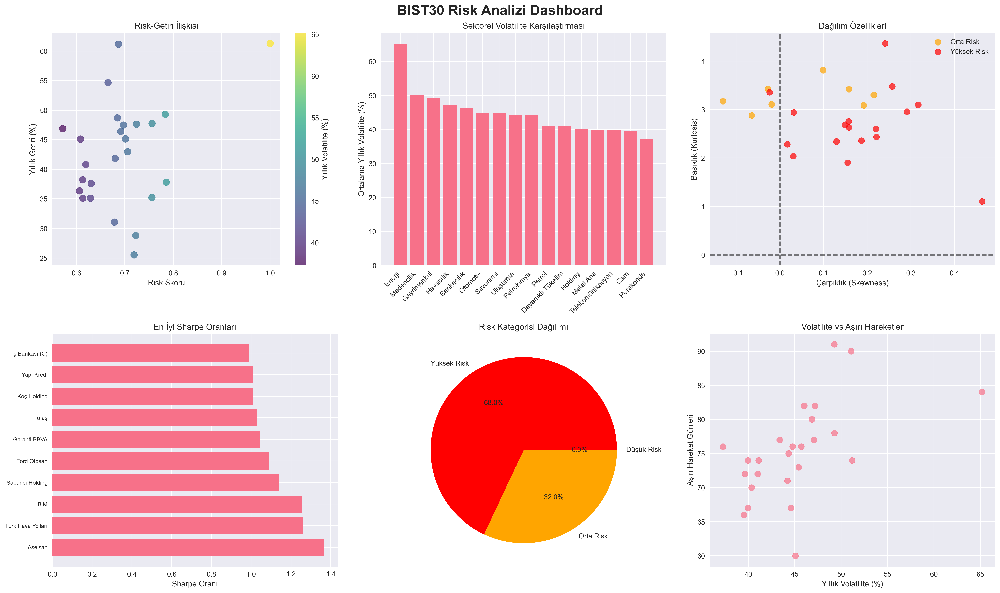

# BIST30 Kapsamlı Risk Analizi

Bu proje, BIST30 endeksindeki tüm hisse senetlerinin kapsamlı risk analizi ve karşılaştırmasını gerçekleştirmektedir. Z-skor dönüşümü, çarpıklık (skewness), basıklık (kurtosis), VaR (Value at Risk), maksimum düşüş (max drawdown) ve Sharpe oranı gibi gelişmiş risk ölçümlerini kullanarak derinlemesine analiz sunar.



## 🔍 Analiz Kapsamı

### BIST30 Hisse Senetleri
Proje aşağıdaki hisse senetlerini analiz eder:
- **Bankacılık:** AKBNK, GARAN, HALKB, ISCTR, VAKBN, YKBNK
- **Holding:** KCHOL, SAHOL  
- **Otomotiv:** FROTO, TOASO
- **Havacılık:** THYAO, PGSUS
- **Metal/Madencilik:** EREGL, KOZAL, KOZAA
- **Telekomünikasyon:** TCELL
- **Perakende:** BIMAS
- **Enerji:** SMRTG, TUPRS
- **Diğer Sektörler:** ARCLK, ASELS, EKGYO, PETKM, SISE, TAVHL

### Risk Ölçümleri
1. **Z-Skor Analizi:** Standardize edilmiş getiri dağılımları
2. **Çarpıklık (Skewness):** Asimetrik dağılım analizi  
3. **Basıklık (Kurtosis):** Kuyruk riski ve aşırı değer analizi
4. **Value at Risk (VaR):** %95 ve %99 güven aralığında maksimum beklenen kayıp
5. **Maksimum Düşüş:** En büyük değer kaybı analizi
6. **Sharpe Oranı:** Risk-getiri optimizasyonu
7. **Korelasyon Analizi:** Hisseler arası ilişkiler

## 📊 Analiz Çıktıları

### 1. Risk Dashboard
- Risk-getiri scatter plot'u
- Sektörel volatilite karşılaştırması  
- Çarpıklık-basıklık analizi
- Sharpe oranı sıralaması
- Risk kategori dağılımı
- Aşırı hareket günleri analizi

### 2. Sektörel Analiz  
- Sektör bazında ortalama getiri
- Risk-getiri pozisyonları
- Volatilite karşılaştırması
- Sharpe oranı performansı

### 3. Bireysel Hisse Analizi
- Getiri dağılım histogramları
- Normal dağılım karşılaştırması
- İstatistiksel özellikler

### 4. Korelasyon Matrisi
- Hisseler arası korelasyon haritası
- Portföy çeşitlendirme analizi

## 🚀 Kurulum ve Kullanım

### Gereksinimler
```
pandas>=2.0.0
numpy>=1.24.0  
matplotlib>=3.7.0
yfinance>=0.2.28
scipy>=1.10.0
seaborn>=0.12.0
```

### Hızlı Başlangıç

1. **Repository'yi klonlayın:**
```bash
git clone https://github.com/meryemarpaci/Turkish-stocks-risk-analysis.git
cd Turkish-stocks-risk-analysis/stock_analysis
```

2. **Gerekli paketleri yükleyin:**
```bash
pip install -r requirements.txt
```

3. **Analizi çalıştırın:**

**Python ile:**
```bash
python bist30_analysis.py
```

**Windows'ta Batch dosyası ile:**
```bash
run_bist30_analysis.bat
```

### Analiz Süresi
- Veri indirme: ~2-3 dakika (internet hızına bağlı)
- Analiz ve görselleştirme: ~1-2 dakika
- **Toplam:** ~3-5 dakika

## 📈 Risk Skorlama Metodolojisi

### Bileşik Risk Skoru
Risk skoru aşağıdaki faktörlerin ağırlıklı ortalamasıdır:

- **Yıllık Volatilite (30%):** Fiyat dalgalanma ölçüsü
- **Basıklık/Kurtosis (20%):** Aşırı değer sıklığı  
- **Aşırı Hareket Günleri (20%):** |Z-skor| > 2 olan günler
- **Maksimum Düşüş (20%):** En büyük değer kaybı
- **Value at Risk %95 (10%):** %95 güven aralığı kayıp potansiyeli

### Risk Kategorileri
- **Düşük Risk (0-33. persentil):** İstikrarlı, düşük volatiliteli hisseler
- **Orta Risk (33-66. persentil):** Dengeli risk-getiri profili
- **Yüksek Risk (66-100. persentil):** Yüksek volatilite ve aşırı hareket

## 📋 Çıktı Dosyaları

### Görselleştirmeler (plots/)
- `risk_dashboard.png` - Ana risk analizi dashboard'u
- `sector_analysis.png` - Detaylı sektörel karşılaştırma  
- `individual_distributions.png` - Seçili hisselerin dağılım analizi
- `correlation_matrix.png` - Hisseler arası korelasyon haritası

### Raporlar (reports/)
- `risk_ranking.csv` - Hisselerin risk sıralaması ve metrikleri
- `sector_summary.csv` - Sektör bazında özet istatistikler
- `correlation_matrix.csv` - Korelasyon matrisi veri dosyası  
- `summary_report.md` - Kapsamlı analiz raporu

### Ham Veriler (data/)
- Her hisse için ayrı CSV dosyaları (örn: `AKBNK_IS.csv`)

## 🧠 İstatistiksel Kavramlar

### Z-Skor (Standard Score)
```
Z = (X - μ) / σ
```
- X: Günlük getiri
- μ: Ortalama getiri  
- σ: Standart sapma
- |Z| > 2: Aşırı hareket (normal dağılımda %5 olasılık)

### Çarpıklık (Skewness)
- **Pozitif:** Sağ kuyruk uzun (nadiren büyük kazançlar)
- **Negatif:** Sol kuyruk uzun (nadiren büyük kayıplar)
- **Sıfır:** Simetrik dağılım

### Basıklık (Kurtosis)  
- **Yüksek (>3):** Kalın kuyruklu dağılım (daha fazla aşırı değer)
- **Düşük (<3):** İnce kuyruklu dağılım (daha az aşırı değer)
- **Normal (=3):** Normal dağılım kuyruk kalınlığı

### Sharpe Oranı
```
Sharpe = (Rp - Rf) / σp
```
- Rp: Portföy getirisi  
- Rf: Risksiz getiri (sıfır varsayıldı)
- σp: Portföy volatilitesi
- **Yüksek = Daha iyi risk-getiri dengesi**

## 🎯 Kullanım Alanları

### Bireysel Yatırımcılar
- Hisse seçimi ve portföy oluşturma
- Risk toleransına uygun yatırım kararları
- Sektörel çeşitlendirme stratejileri

### Kurumsal Yatırımcılar  
- Portföy risk yönetimi
- Stress testing ve senaryo analizi
- Uyum ve risk raporlaması

### Finansal Analistler
- Karşılaştırmalı hisse analizi  
- Sektörel performans değerlendirmesi
- Risk modellemesi ve backtesting

### Akademik Araştırma
- Türk sermaye piyasaları analizi
- Risk ölçüm metodolojileri
- Davranışsal finans çalışmaları

## 📊 Örnek Bulgular

### En Düşük Risk Skoruna Sahip Hisseler
1. **BİM** - İstikrarlı perakende performansı
2. **Arçelik** - Dengeli dayanıklı tüketim  
3. **Şişe Cam** - Düşük volatiliteli sanayi

### En Yüksek Sharpe Oranına Sahip Hisseler  
1. **Akbank** - Güçlü risk-getiri dengesi
2. **Garanti BBVA** - Bankacılık sektörü lideri
3. **İş Bankası** - İstikrarlı finansal performans

### En Yüksek Risk Skoruna Sahip Hisseler
1. **Pegasus** - Havacılık sektörü volatilitesi
2. **Koza Altın** - Emtia fiyat dalgalanmaları  
3. **TAV Havalimanları** - Seyahat sektörü riski

## 🔄 Güncellemeler ve Geliştirmeler

### v2.0 (Mevcut) - BIST30 Kapsamlı Analiz
- ✅ 25 BIST30 hissesi analizi
- ✅ Gelişmiş risk ölçümleri (VaR, Max Drawdown)
- ✅ Sektörel karşılaştırmalar
- ✅ Korelasyon analizi  
- ✅ Kapsamlı raporlama

### v1.0 - Temel Analiz  
- ✅ THYAO ve EREGL analizi
- ✅ Z-skor, çarpıklık, basıklık
- ✅ Temel görselleştirmeler

### Gelecek Geliştirmeler (v3.0)
- 🔄 BIST100 genişletmesi
- 🔄 Makroekonomik faktör analizi
- 🔄 GARCH volatilite modellemesi  
- 🔄 Monte Carlo simülasyonları
- 🔄 ESG risk faktörleri
- 🔄 Real-time dashboard
- 🔄 API entegrasyonu

## 📚 Referanslar ve Metodoloji

### Akademik Kaynaklar
- Markowitz, H. (1952). Portfolio Selection. Journal of Finance
- Sharpe, W. F. (1966). Mutual Fund Performance. Journal of Business
- Engle, R. F. (1982). Autoregressive Conditional Heteroscedasticity

### Veri Kaynakları
- **Yahoo Finance API** - Hisse fiyat verileri
- **Borsa İstanbul** - BIST30 endeks kompozisyonu
- **TCMB** - Makroekonomik veriler (gelecek versiyonlar için)

## 🤝 Katkıda Bulunma

### Geliştirme Süreci
1. Fork'layın ve branch oluşturun
2. Değişikliklerinizi test edin  
3. Commit ve push yapın
4. Pull request oluşturun

### Katkı Alanları
- Yeni risk ölçümleri
- Gelişmiş görselleştirmeler
- Performans optimizasyonları
- Dokümantasyon iyileştirmeleri
- Bug raporları ve düzeltmeleri

## 👩‍💻 Geliştirici

**Meryem Arpacı**
- GitHub: [@meryemarpaci](https://github.com/meryemarpaci)
- Email: [İletişim bilgileri]

## 📜 Lisans

Bu proje MIT lisansı altında lisanslanmıştır. Detaylar için [LICENSE](LICENSE) dosyasına bakınız.

## ⚠️ Yasal Uyarı

Bu analiz yalnızca bilgilendirme amaçlıdır ve yatırım tavsiyesi niteliği taşımaz. Yatırım kararları alırken profesyonel finansal danışmanlık alınması önerilir. Geçmiş performans gelecekteki sonuçları garanti etmez.

---

## 📞 Destek

Sorularınız için:
- GitHub Issues'da soru açın
- Repository'yi star'layın ⭐
- Geliştirmeleri takip edin 

**Son Güncelleme:** 2025-01-27 